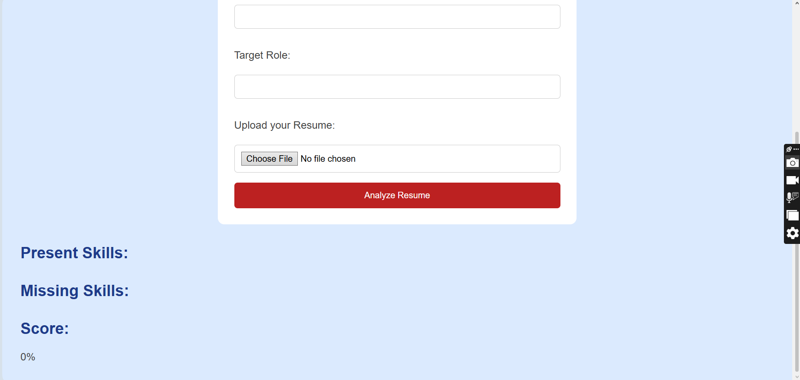
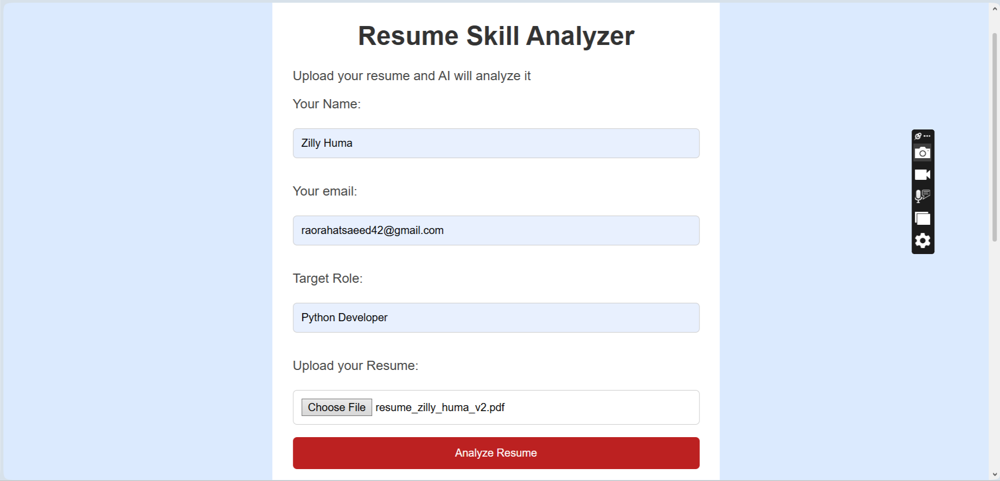
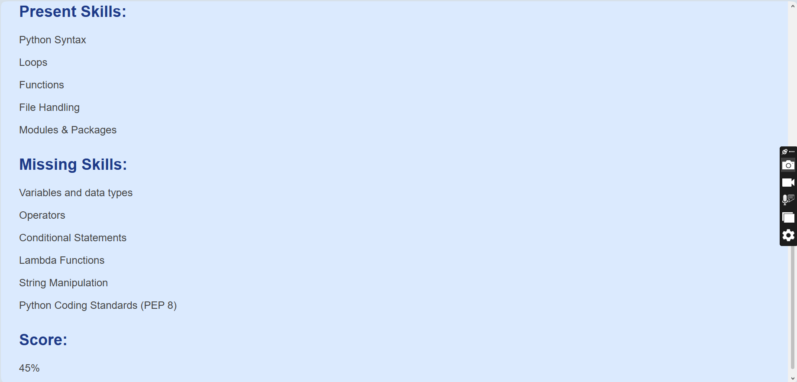
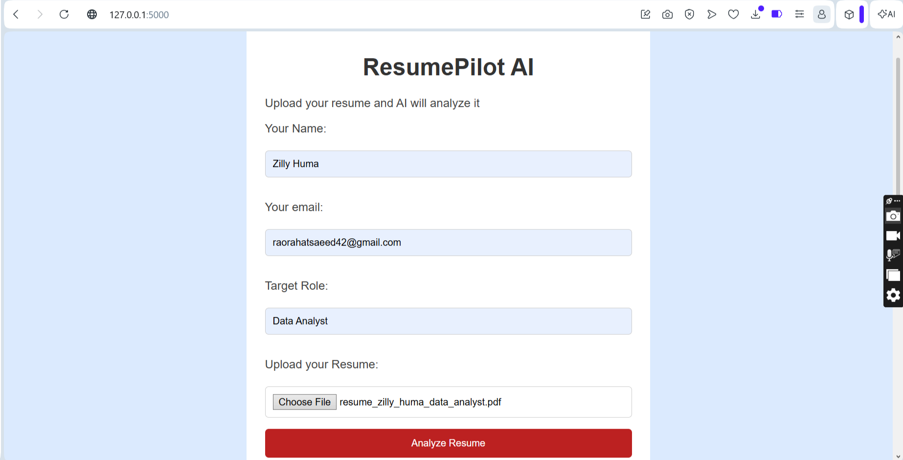
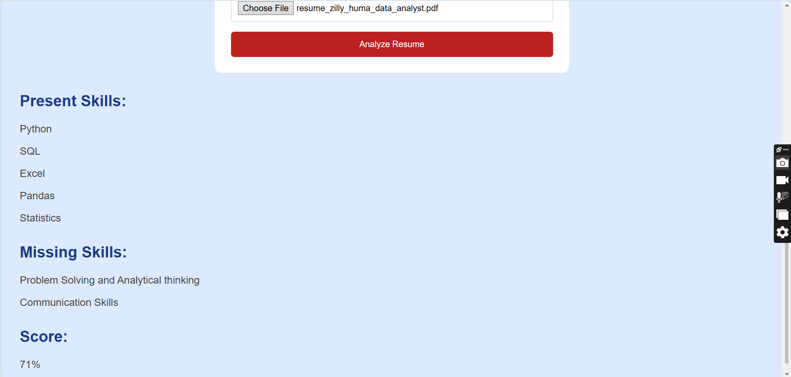

# ResumePilot AI

ResumePilot AI is a simple web application built with Flask that analyzes a resume based on the job role selected by the user. It compares the skills found in the resume with the required skills for that role and displays the results.

## Features

* Upload a resume in PDF format
* Extract text from the uploaded resume
* Compare resume skills with the selected job role
* Display present skills
* Display missing skills
* Calculate a resume match score
* Support multiple job roles

## Technologies Used

* Python
* Flask
* HTML
* CSS
* PyPDF

## How to Run

1. Install the required libraries:

```
pip install -r requirements.txt
```

2. Run the project:

```
python main.py
```

3. Open your browser and visit:

```
http://127.0.0.1:5000/
```








